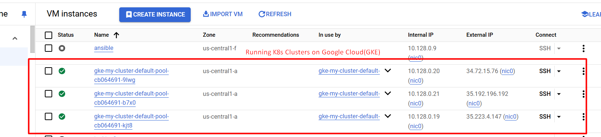
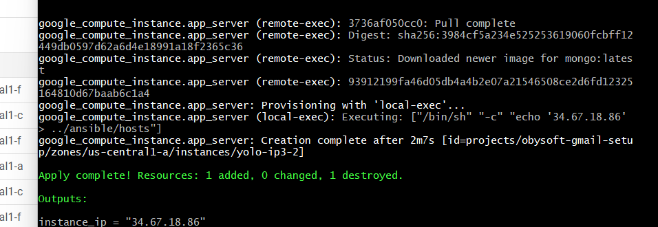
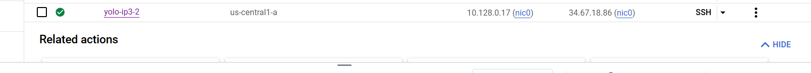
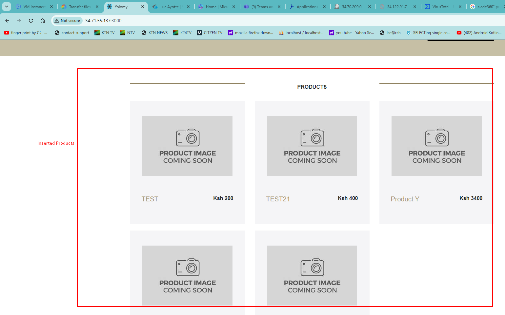
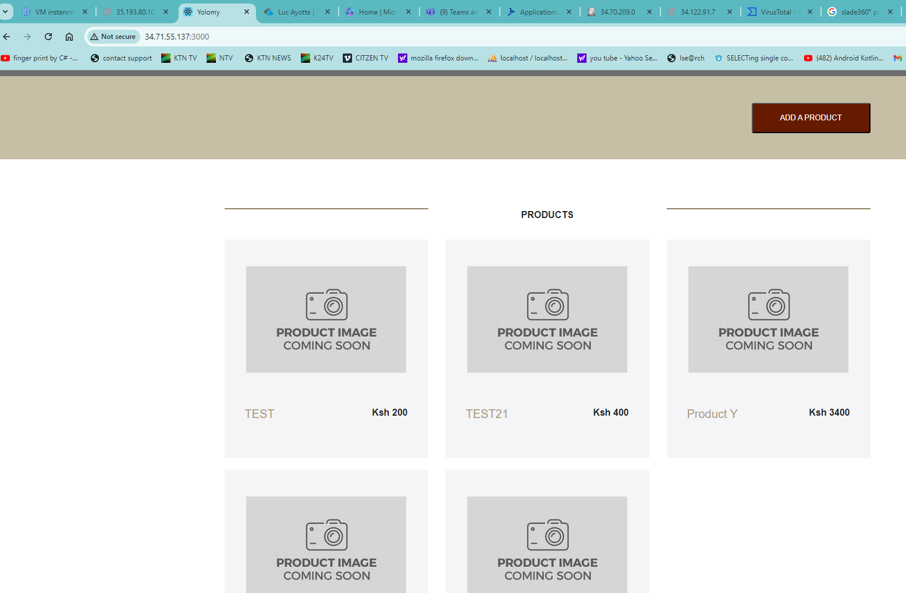
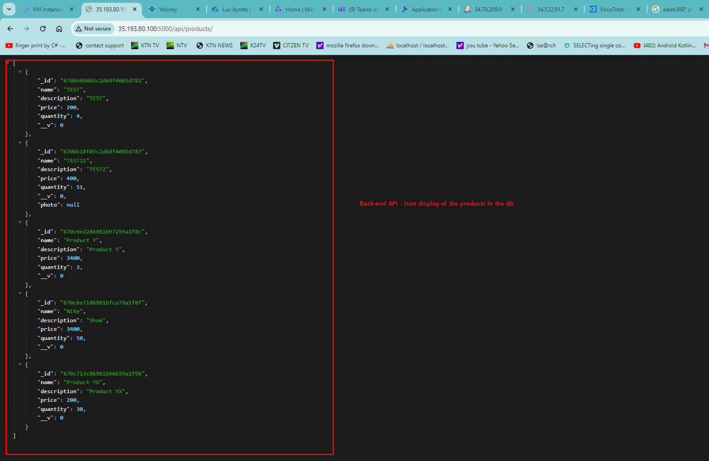

# Overview
This project involved the containerization and deployment of a full-stack yolo application using Docker. The project use React for front-end and NodeJs Express framework for backend, MongoDb for database.
The project uses ansible and terraform to configure and manage infrastructure on Google Cloud (GCP).

The application is being orchestrated with Kubernetes running on Google Cloud Kubernetes Engine
## Running K8 Clusters

# Steps to follow
1. Register on Google Cloud https://cloud.google.com/?hl=en. If you have an account, login to the console
2. Enable Kubernetes Engine API: Ensure the Kubernetes Engine API is enabled for your project
3. Run this command to create your cluster. in this case, I am using my-cluster as the cluster name 

gcloud container clusters create my-cluster --zone us-central1-a --num-nodes 3 --cluster-version latest --machine-type e2-small --disk-type pd-standard 

4. Running the deplyments, secrets and services

    - kubectl apply -f backend-deployment-service.yaml
    - kubectl apply -f frontend-deployment-service.yaml
    - kubectl apply -f mongodb-statefulset.yaml
    - kubectl apply -f mongodb-secret.yaml  # Apply secrets
    

5. Check Deployments

- kubectl get deployments
- kubectl get statefulsets
- kubectl get services

6. Accessing the front end
 - kubectl get svc frontend-service
# Set up steps
1. create sub-directory named stage_2 to hold directories for ansible and terraform
2. Setup required files, ie main.tf,variables.tf,terraform.tfvars for terraform 

# Configure and provision infrastructure
1. After having correct configurations ;
2. Run terraform init on your terminal to Initialize Terraform and download required provider, 
  terraform plan to review what changes will be made.
  terraform apply to Apply the changes to your infrastructure.

# Created VM in GCP
# Successful provisioned infrastrure with terraform

# Created VM in GCP console

## We are pulling the images from docker-hub (The steps to follow to create the docker images and push to diocker hub is listed below:)

# Requirements
Install the docker engine here:
- [Docker](https://docs.docker.com/engine/install/) 

   # For Ubuntu Users -run these commands
    - sudo apt update && sudo apt install -y 
    - apt-transport-https ca-certificates curl software-properties-common && curl -fsSL https://download.docker.com/linux/ubuntu/gpg | sudo apt-key add - && sudo add-apt-repository "deb [arch=amd64] https://download.docker.com/linux/ubuntu $(lsb_release -cs) stable" && sudo apt update && sudo apt install -y docker-ce

        # OR 
        - sudo apt update && sudo apt install -y 
        - sudo apt install docker

## How to launch the application 
  # 1. Lauching without docker
    - Pull the code and run npm install to install dependancies
    -Navigate to client folder [cd client] and run npm start to launch front-end application
    -Navigate to backend folder [cd backend] and run npm start to laucnh back-end application
  # 2. Launch with docker by building the docker image
  - Pull the code
  -Run docker-compose up --build

## Site link. Access the live deployed site in a docker container
http://34.71.55.137:3000/

## Push Images to Docker-hub
 # 1. Login to your docker-hub
 sudo docker login
 # 2. Push the images to docker-hub 
-[Client-Image] sudo docker push knowen2023/knowen-yolo-client:v1.0.0
 -[Back-end-Image] sudo docker push knowen2023/knowen-yolo-backend:v1.0.0

# Images pushed to Docker hub

# Image Sizes

# Upldated products 
 

# BacK-end API

