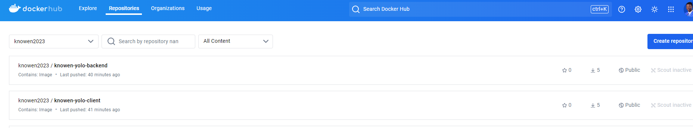
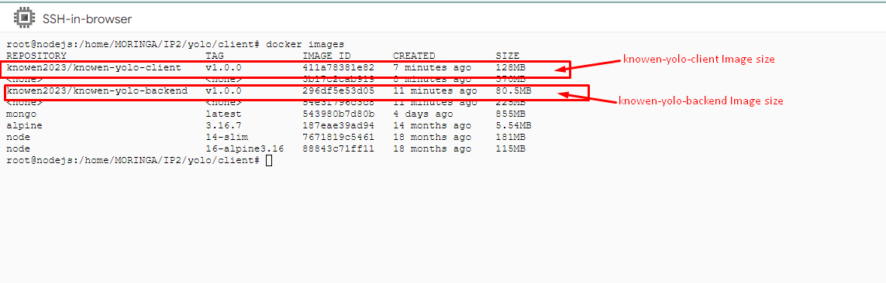

# Overview
This project involved the containerization and deployment of a full-stack yolo application using Docker. The project use React for front-end and NodeJs Express framework for backend, MongoDb for database.

# Requirements
Install the docker engine here:
- [Docker](https://docs.docker.com/engine/install/) 

   # For Ubuntu Users -run these commands
    - sudo apt update && sudo apt install -y 
    - apt-transport-https ca-certificates curl software-properties-common && curl -fsSL https://download.docker.com/linux/ubuntu/gpg | sudo apt-key add - && sudo add-apt-repository "deb [arch=amd64] https://download.docker.com/linux/ubuntu $(lsb_release -cs) stable" && sudo apt update && sudo apt install -y docker-ce

        # OR 
        - sudo apt update && sudo apt install -y 
        - sudo apt install docker

## How to launch the application 
  # 1. Lauching without docker
    - Pull the code and run npm install to install dependancies
    -Navigate to client folder [cd client] and run npm start to launch front-end application
    -Navigate to backend folder [cd backend] and run npm start to laucnh back-end application
  # 2. Launch with docker by building the docker image
  - Pull the code
  -Run docker-compose up --build

## Site link. Access the live deployed site in a docker container
http://34.71.55.137:3000/

## Push Images to Docker-hub
 # 1. Login to your docker-hub
 sudo docker login
 # 2. Push the images to docker-hub 
-[Client-Image] sudo docker push knowen2023/knowen-yolo-client:v1.0.0
 -[Back-end-Image] sudo docker push knowen2023/knowen-yolo-backend:v1.0.0

# Images pushed to Docker hub

# Image Sizes

